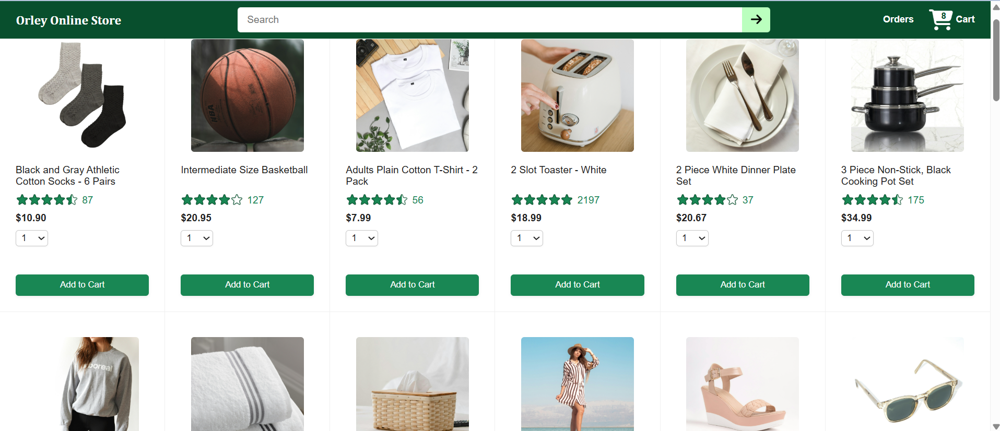
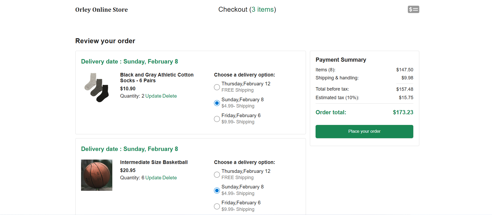
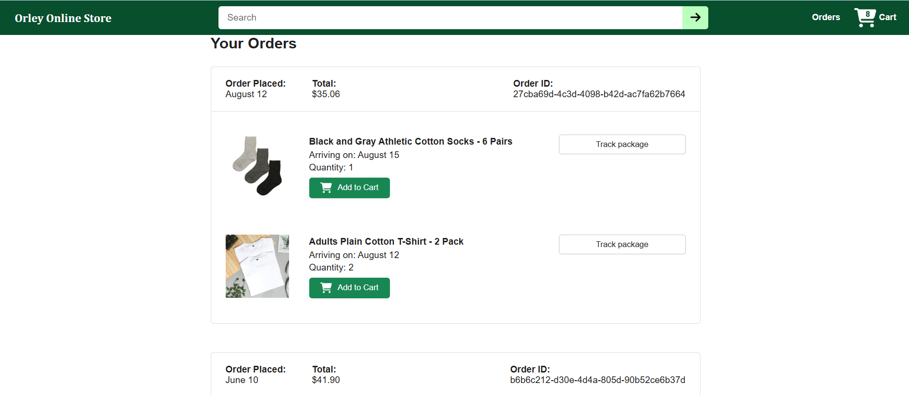

# Ecommerce Project

A React + Vite storefront that pulls product data from a local backend, supports cart interactions, and walks through checkout, orders, and tracking views.

## Features
- Product grid with quantity selection and add-to-cart
- Live cart count in the header
- Checkout flow with delivery options and payment summary
- Orders history with delivery estimates
- Tracking view with delivery status

## Pages
- `/` Home
- `/checkout` Checkout flow
- `/orders` Orders history
- `/tracking` Tracking detail

## Tech Stack
- React 19 + React Router
- Vite 6
- Axios for API calls
- Day.js for dates
- ESLint

## Getting Started
1. Start the backend API (in `ecommerce-backend`).
2. Install and run the frontend:

```bash
cd ecommerce-project
npm install
npm run dev
```

Open `http://localhost:5173`.

The Vite dev server proxies `/api` and `/images` to `http://localhost:3000` (see `vite.config.js`).

## Scripts
- `npm run dev` Start the dev server
- `npm run build` Production build
- `npm run preview` Preview production build
- `npm run lint` Lint the project

## Screenshots



